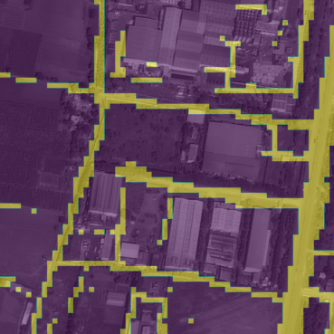

# Road Detection From Panchromatic Satellite Images Using Various Deep-Learning Models

In numerous civilian and military applications, the extraction of map items, such as roads,
rivers, and buildings, from high-resolution satellite images is a crucial undertaking. In this
project, pixel-wise binary segmentation in remote sensing images is used to compare various
deep-learning models for road detection. The dataset creation involves pairing original
panchromatic images with manually labelled binary masks depicting the roads along with
the augmentation of the entire dataset to increase sample diversity. The selected models
include our custom model RoadSegNN [with ResNet-50, ResNet-101, and Swin-T
backbones, along with an FPN, and custom Prediction module (Head)] and SegNet, which
are trained to perform binary segmentation of roads. Run-time evaluation and qualitative
and quantitative indicators are used in validation to evaluate computing efficiency and
prediction accuracy. In order to solve the binary road segmentation problem, the study offers
insights into the performance-specific subtleties of each model (and their variants) taken
into consideration.  

For this project four models have been selected:
- RoadSegNN (with ResNet-50 backbone)
- RoadSegNN (with ResNet-101 backbone)
- RoadSegNN (with Swin-T backbone)
- SegNet (Modified for our use case)

## Architecture of RoadSegNN Model (Novel Model)
<!--    -->
Printout is being carried.

## Architecture of ResNet-50 & ResNet-101

  
   

    

## Architecture of SegNet Model

## Sample Outputs
### Example 1:

    <table style="margin-bottom:0;">
        <tr>
            <th colspan=2>
Input Image
</th>
            <th>
Output - SegNet
</th>
        </tr>
        <tr>
            <td colspan=2>

</td>
            <td>

</td>
        </tr>
        <tr>
            <th>
Output - RoadSegNN (ResNet-50 backbone)
</th>
            <th>
Output - RoadSegNN (ResNet-101 backbone)
</th>
            <th>
Output - RoadSegNN (Swin-T backbone)
</th>
        </tr>
        <tr>
            <td>

</td>
            <td>

</td>
            <td>

</td>
        </tr>
    </table>

### Example 2:

    <table style="margin-bottom:0;">
        <tr>
            <th colspan=2>
Input Image
</th>
            <th>
Output - SegNet
</th>
        </tr>
        <tr>
            <td colspan=2>

</td>
            <td>

</td>
        </tr>
        <tr>
            <th>
Output - RoadSegNN (ResNet-50 backbone)
</th>
            <th>
Output - RoadSegNN (ResNet-101 backbone)
</th>
            <th>
Output - RoadSegNN (Swin-T backbone)
</th>
        </tr>
        <tr>
            <td>

</td>
            <td>

</td>
            <td>

</td>
        </tr>
    </table>

